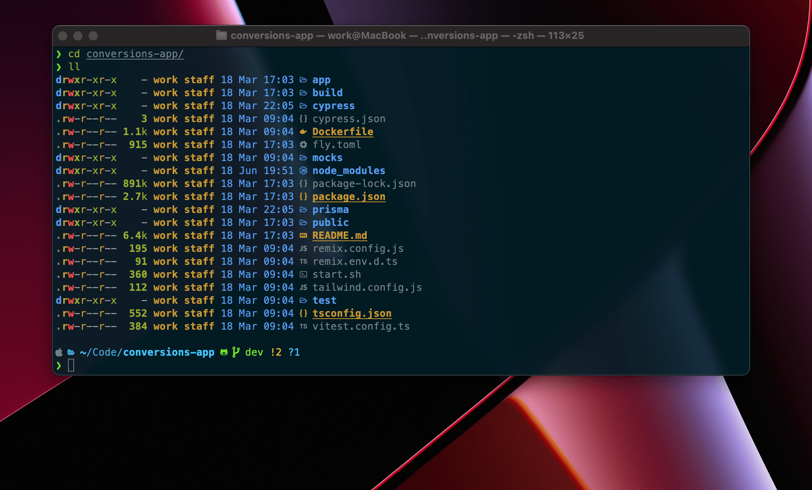

# Robert's dotfiles

**Warning:** These are my personal dotfiles, they probably won't suit you but feel free to take inspiration. Use at your own risk!

## Contents
- git config
  - [git-cz](https://github.com/streamich/git-cz)
- zsh config
  - [ohmyzsh](https://ohmyz.sh)
  - [p10k](https://github.com/romkatv/powerlevel10k)
- vim (NeoVim) config
  - Plugins are managed with [vim-plug](https://github.com/junegunn/vim-plug)
  - Statusline by [lualine](https://github.com/nvim-lualine/lualine.nvim)
  
